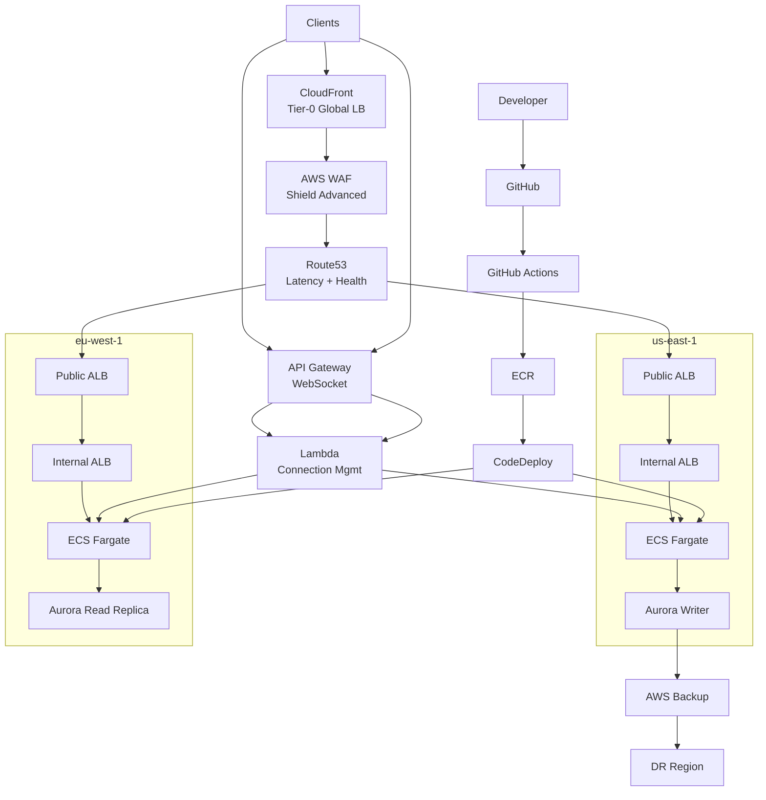

# 🌍 Production-Hardened Multi-Region AWS Platform

**Terraform Blueprint for Global, Mission-Critical Systems**

> **Enterprise-grade, Netflix-style AWS reference architecture**  
> Designed for **high availability, global scale, security, disaster recovery, and cost efficiency**.

---

## 🚀 Overview

This repository provides a **production-ready Terraform platform** for running **mission-critical workloads on AWS** across **multiple regions**, using **battle-tested hyperscale patterns** inspired by **Netflix, Prime Video, and large SaaS platforms**.

This is **not a demo**. It is designed for teams that **expect failure and engineer for resilience**.

---

## 🧭 Who This Is For

- SaaS platforms  
- FinTech & regulated workloads  
- Gaming & real-time systems  
- High-traffic APIs  
- Enterprise & Fortune 500 cloud platforms  

---

## ✨ Core Capabilities

- 🌍 Global multi-region architecture  
- ⚖️ Netflix-style multi-tier load balancing  
- 🔒 Edge security with AWS WAF & Shield Advanced  
- 🚀 Zero-downtime ECS deployments  
- 🔁 Cost-optimized disaster recovery (Active/Passive)  
- 🔌 Real-time WebSocket workloads  
- 💾 Cross-region encrypted backups  
- 🔄 Fully automated CI/CD pipelines  
- 🧠 Failure isolation & blast-radius reduction  

---

## 📊 Availability & Reliability Targets

- **Single ALB (AWS SLA)**: ~99.99% availability  
- **Multi-Region Platform (Observed)**: Effectively zero downtime for most failures  
- **Published Platform SLO**: **99.95%**  

---

## 🏗️ High-Level Architecture

---

## 🎬 Netflix-Style Multi-Tier Load Balancing

- **Tier 0**: CloudFront + WAF + Shield  
- **Tier 1**: Route53 + Regional ALBs  
- **Tier 2**: Internal ALBs & Service Discovery  

Traffic is load-balanced **multiple times**, isolating failures at every layer.

---

## 🔁 Disaster Recovery (Active/Passive)

| Component | Primary | DR |
|---------|---------|----|
| ECS | Running | Desired = 0 |
| ALB | Active | Pre-created |
| RDS | Writer | Read-only |
| NAT | Enabled | Disabled |

---

## 🚀 CI/CD Pipelines

- GitHub → GitHub Actions  
- Docker build & push to ECR  
- ECS Blue/Green via CodeDeploy  
- Canary / linear traffic shifting  
- Automatic rollback  

---

## 🧪 Chaos Engineering

- AWS Fault Injection Simulator  
- ECS task termination  
- AZ impairment  
- Forced DB failover  

---

## 📜 License

MIT License
